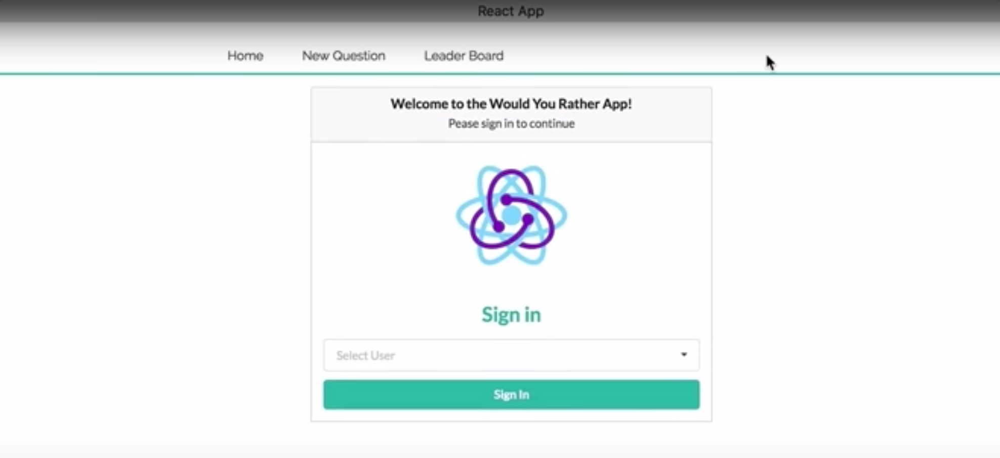
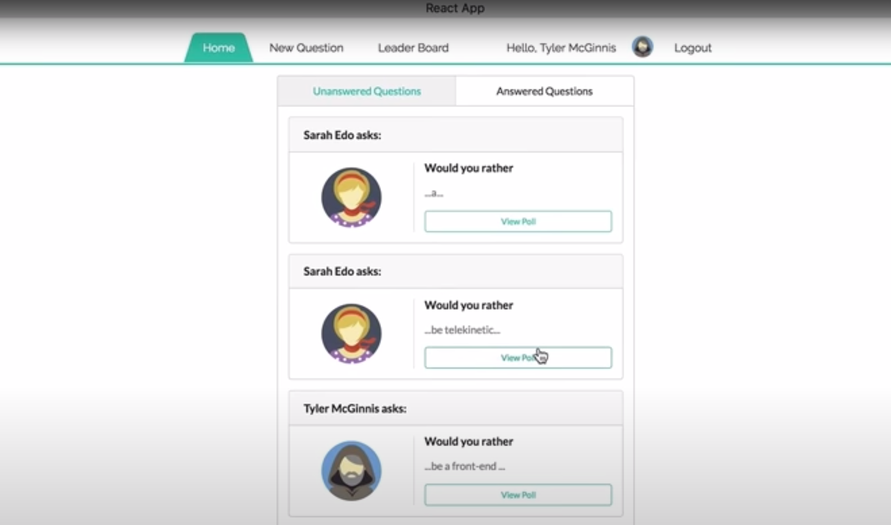
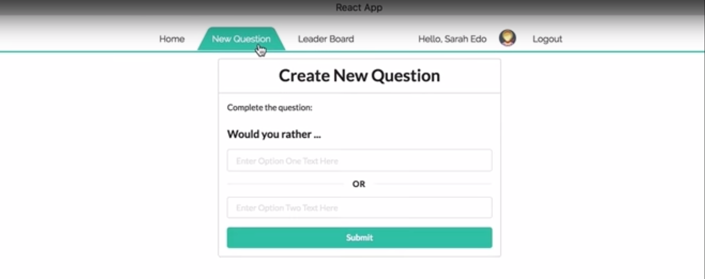
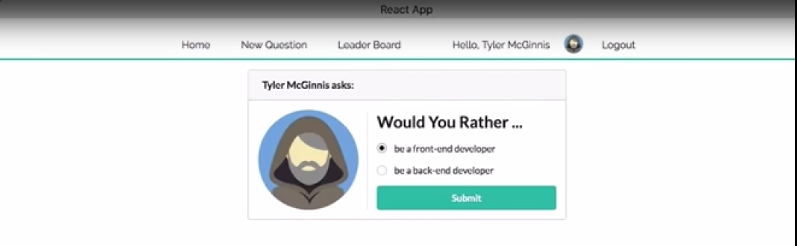
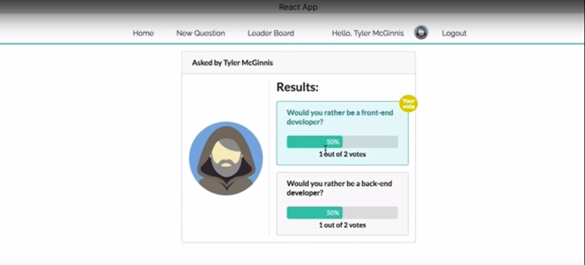
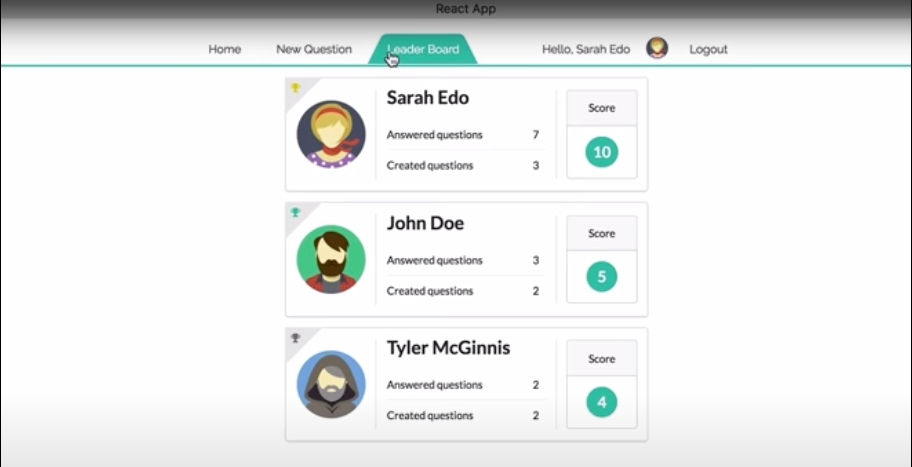

# Would You Rather React App
## Project Overview
The project is build as a web application that lets a user play the “Would You Rather?” game. The game goes like this: A user is asked a question in the form: “Would you rather [option A] or [option B] ?”. Answering "neither" or "both" is against the rules.
## App Functionality
Using the app, users will be able to 
* **answer questions**, 
* **see which questions they haven’t answered**,
* **see how other people have voted**,
* **post questions**, and 
* **see the ranking of users on the leaderboard**

## Create React App
This project was bootstrapped with [Create React App](https://github.com/facebook/create-react-app).
## Project dependencies
react-scripts from npm registry is used to build and run the app.
Please refer dependencies and scripts section in [`package.json`](package.json) for more details.

In the project directory, you can run the below scripts:
* install all project dependencies with `npm install`
* start the development server with `npm start`
* the app can be accessed in the browser using `http://localhost:3000/`

Additional information:
* project can be build with `npm run build`
## Technologies used
* `React UI Library` is used to design the presentational and controlled UI components
* `React-Bootstrap` UI Foundation library
* `Redux` is used to improve the predictability of the application’s state; establish strict rules for getting, listening, and updating the store; and identify what state should live inside of Redux and what state should live inside of React components.
For this application, most of the application’s state is managed by Redux. However, component state has been used to handle form input fields and controlled components. Otherwise, the rest of the state for the application is controlled by the reducers.
* Dispatch of actions to reducers is managed via `Redux Thunk` middleware. Also logger middleware is used for debugging purpose.
* `React Router` is used for managing application routes

## Application Routes
* Login: `/`
* Home Page: `/home`
* New Question: `/add`
* LeaderBoard: `/leaderboard`
* Specific Poll Question: `questions/:question_id`
## Backend Server

The App leverages the [`_DATA.js`](src/utils/_DATA.js) which serves as a backend server 
and provies the following methods to perform necessary operations on the backend:

* `_getUsers`
* `_getQuestions`
* `_saveQuestion`
* `_saveQuestionAnswer`

Limitation: The app uses a fake backend database server so the application state will 
not persist after refresh

## Application UI design
1. SignIn page

2. Home page

3. New Question page

4. Vote Submit page

5. Poll Result page

6. LeaderBoard page

Note: The screenshots are referenced from Udacity materials
